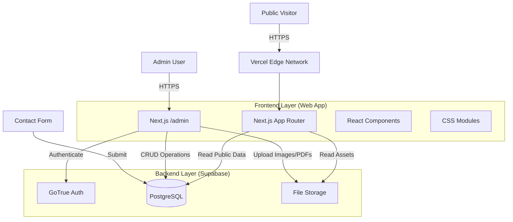

# Architecture Blueprint

## 1. System Components

## 2. Data Flow

### Product Creation Flow
1.  **Input**: Admin fills "Add Product" form (Name, Specs, Image file).
2.  **Upload**: Client uploads Image/PDF directly to Supabase Storage bucket `public-assets`. Rules allow write access only for authenticated admins.
3.  **Process**: Supabase returns Asset URL.
4.  **Save**: Client sends POST to `products` table with metadata + Asset URL.
5.  **Revalidate**: Next.js calls `revalidatePath('/products')` to refresh cache.
6.  **Output**: New product appears on public site.

### Inquiry Flow
1.  **Input**: User fills Contact Form.
2.  **Process**: API Route `/api/contact` handles submission.
3.  **Save**: Insert into `inquiries` table.
4.  **Notify**: (Optional) Trigger Supabase Edge Function to send Email via Resend/SendGrid.
5.  **Output**: User sees "Success" message.

## 3. Database Schema (Supabase PostgreSQL)

### `products`
| Column | Type | Notes |
| :--- | :--- | :--- |
| `id` | UUID | Primary Key |
| `name` | Text | Product Name |
| `slug` | Text | Unique URL friendly string |
| `category_id` | UUID | FK to Categories |
| `specs` | JSONB | Array of strings |
| `image_url` | Text | |
| `pdf_url` | Text | |
| `created_at` | Timestamptz | |
| `updated_at` | Timestamptz | |

### `categories`
| Column | Type | Notes |
| :--- | :--- | :--- |
| `id` | UUID | Primary Key |
| `name` | Text | Display Name (e.g. "0.5mm FFC") |
| `slug` | Text | |
| `description` | Text | |

### `news`
| Column | Type | Notes |
| :--- | :--- | :--- |
| `id` | UUID | PK |
| `title` | Text | |
| `slug` | Text | |
| `content` | Text | HTML/Markdown |
| `published_at` | Timestamptz | |
| `is_published` | Boolean | Draft/Published state |

## 4. State Management
- **Server State**: React Server Components (RSC) fetch data directly from DB.
- **Client State**: Minimal local state (React `useState`) for form inputs.
- **Admin Data**: SWR or React Query (TanStack Query) for Admin Dashboard lists to ensure "fresh" data viewing.

## 5. Security & Dependencies
- **Auth Provider**: Supabase Auth (Email/Password).
- **Database**: Supabase (PostgreSQL).
- **Environment Variables**:
    - `NEXT_PUBLIC_SUPABASE_URL`
    - `NEXT_PUBLIC_SUPABASE_ANON_KEY`
    - `SUPABASE_SERVICE_ROLE_KEY` (Server-side operations only)
